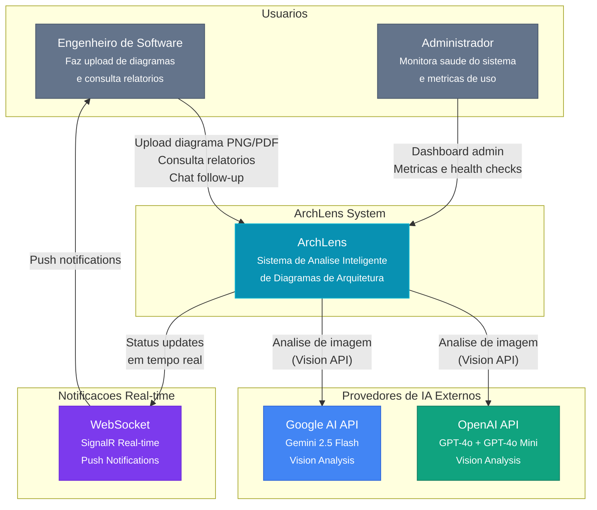
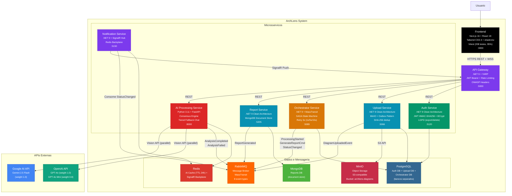

# ArchLens - Diagramas C4

> Modelo C4 (Context, Containers, Components) do sistema ArchLens.
> Referencia: [c4model.com](https://c4model.com)

---

## Nivel 1 - Contexto do Sistema

Visao de alto nivel mostrando o ArchLens, seus usuarios e sistemas externos.

**Descricao:**
- **Engenheiro de Software** - Usuario principal. Faz upload de diagramas de arquitetura (PNG/PDF), recebe relatorios com componentes, riscos e recomendacoes, e pode fazer perguntas de follow-up via chat contextual.
- **Administrador** - Acessa o dashboard admin com metricas de saude dos servicos, taxas de sucesso/falha, e metricas de infraestrutura (Prometheus).
- **OpenAI API** - Provider externo de IA (GPT-4o e GPT-4o Mini) para analise de diagramas via Vision API.
- **Google AI API** - Provider externo de IA (Gemini 2.5 Flash) para analise de diagramas via Vision API.
- **WebSocket (SignalR)** - Canal de comunicacao real-time para notificar usuarios sobre mudancas de status das analises.

---

## Nivel 2 - Containers

Decomposicao do sistema em containers (servicos deployaveis independentemente), mostrando tecnologias, responsabilidades e protocolos de comunicacao.

**Containers e Responsabilidades:**

| Container | Tecnologia | Responsabilidade | Banco de Dados |
|-----------|-----------|------------------|----------------|
| **Frontend** | Next.js 16, React 19, TypeScript, Tailwind CSS 4, shadcn/ui | Interface web, admin dashboard, chat IA | - |
| **API Gateway** | .NET 9, YARP | Roteamento, autenticacao JWT, rate limiting, CORS, OWASP headers | - |
| **Auth Service** | .NET 9, Clean Architecture, MediatR | Registro, login, JWT, BCrypt, LGPD (export/delete dados) | PostgreSQL |
| **Upload Service** | .NET 9, Clean Architecture, MediatR | Upload de diagramas, validacao (magic bytes), dedup SHA-256, Outbox | PostgreSQL + MinIO |
| **Orchestrator** | .NET 9, MassTransit SAGA | Coordenacao do fluxo, state machine, retry 3x com backoff | PostgreSQL |
| **AI Processing** | Python 3.11, FastAPI, Hexagonal | Analise multi-provider, consensus engine, chat tiered fallback | Redis (cache) |
| **Report Service** | .NET 9, Clean Architecture | Geracao e consulta de relatorios | MongoDB |
| **Notification** | .NET 9, SignalR | Push real-time via WebSocket, status updates | Redis (backplane) |

**Comunicacao:**
- **Sincrona:** REST via API Gateway (HTTPS) para todas as operacoes de leitura e upload
- **Assincrona:** RabbitMQ com MassTransit para orquestracao SAGA (8 tipos de evento)
- **Real-time:** SignalR WebSocket para notificacoes de status ao frontend

---

## Nivel 3 - Componentes (AI Processing Service)

Detalhamento interno do servico mais complexo do sistema: o pipeline de IA com motor de consenso e chat com tiered fallback.

```mermaid
graph TB
    subgraph "AI Processing Service (Python FastAPI :8000)"
        API["API Layer<br/><small>FastAPI Routes<br/>/analyze, /chat, /health</small>"]
        SVC["Analysis Service<br/><small>Orquestra pipeline<br/>Parallel provider execution<br/>Timeout: 45s por provider</small>"]

        subgraph "Providers (Hexagonal Ports)"
            OAI["OpenAI Provider<br/><small>GPT-4o (weight 1.0)<br/>GPT-4o-mini (weight 0.8)<br/>Retry: 2 attempts<br/>Backoff: 1-5s</small>"]
            GEM["Gemini Provider<br/><small>Gemini 2.5 Flash (weight 1.0)<br/>Response normalization<br/>Retry: 1 attempt</small>"]
        end

        PRE["Preprocessing<br/><small>Resize max 2048x2048<br/>PDF to Image (pdf2image)<br/>SHA-256 file hash</small>"]

        CE["Consensus Engine<br/><small>Component merge: fuzzy match<br/>Levenshtein similarity 65%<br/>Weighted score aggregation<br/>Confidence: % agreement</small>"]

        GR["Guardrails<br/><small>JSON schema validation<br/>Cross-reference check<br/>Score range 0-10<br/>Min components filter</small>"]

        CHAT["Chat Handler<br/><small>Tiered Fallback:<br/>1. GPT-4o-mini (8s)<br/>2. Gemini Flash (10s)<br/>3. GPT-4o (15s)<br/>SSE streaming response</small>"]

        CACHE["Redis Cache<br/><small>File hash dedup (TTL 24h)<br/>Analysis result caching<br/>Chat context storage</small>"]

        PUB["RabbitMQ Publisher<br/><small>AnalysisCompletedEvent<br/>AnalysisFailedEvent<br/>MassTransit envelope format</small>"]

        CON["RabbitMQ Consumer<br/><small>ProcessingStartedEvent<br/>Downloads file from MinIO<br/>Triggers analysis pipeline</small>"]
    end

    CON -- "file_bytes" --> PRE
    API -- "POST /analyze" --> SVC
    API -- "POST /chat" --> CHAT
    SVC --> PRE
    PRE -- "image_bytes\n(parallel)" --> OAI
    PRE -- "image_bytes\n(parallel)" --> GEM
    OAI -- "ProviderResponse" --> CE
    GEM -- "ProviderResponse" --> CE
    CE -- "ConsensusResult" --> GR
    GR -- "validated result" --> PUB
    GR -- "cache by hash" --> CACHE
    CHAT -- "tier 1 (8s)" --> OAI
    CHAT -- "tier 2 (10s)" --> GEM

    style API fill:#009688,stroke:#00796b,color:#fff
    style SVC fill:#0891b2,stroke:#0e7490,color:#fff
    style OAI fill:#10a37f,stroke:#1a7f64,color:#fff
    style GEM fill:#4285f4,stroke:#3367d6,color:#fff
    style PRE fill:#78909c,stroke:#546e7a,color:#fff
    style CE fill:#ff6f00,stroke:#e65100,color:#fff
    style GR fill:#d32f2f,stroke:#b71c1c,color:#fff
    style CHAT fill:#7c3aed,stroke:#6d28d9,color:#fff
    style CACHE fill:#dc382d,stroke:#b52e25,color:#fff
    style PUB fill:#ff6600,stroke:#cc5200,color:#fff
    style CON fill:#ff6600,stroke:#cc5200,color:#fff
```

**Componentes e Responsabilidades:**

| Componente | Responsabilidade | Detalhes |
|------------|-----------------|----------|
| **API Layer** | Endpoints REST | `/health` (liveness), `/analyze` (upload direto), `/chat` (follow-up SSE) |
| **Analysis Service** | Orquestracao do pipeline | Executa providers em paralelo, coleta respostas, aplica consensus + guardrails |
| **OpenAI Provider** | Adapter para OpenAI API | GPT-4o (analise, weight 1.0) + GPT-4o-mini (chat, weight 0.8). Retry 2x com backoff 1-5s |
| **Gemini Provider** | Adapter para Google AI API | Gemini 2.5 Flash (weight 1.0). Normalizacao de tipos na resposta. Retry 1x |
| **Preprocessing** | Preparacao da imagem | Resize para max 2048x2048, conversao PDF para imagem, calculo SHA-256 |
| **Consensus Engine** | Merge de respostas | Fuzzy match de componentes (Levenshtein 65%), media ponderada de scores, calculo de confianca |
| **Guardrails** | Validacao de qualidade | Schema validation, cross-reference entre providers, range enforcement (scores 0-10) |
| **Chat Handler** | Chat follow-up | Tiered fallback: Mini (8s) -> Gemini (10s) -> GPT-4o (15s). Contexto do relatorio + historico |
| **Redis Cache** | Caching e dedup | Resultado por file hash (TTL 24h), evita re-analise de diagramas identicos |
| **RabbitMQ Publisher** | Publicacao de eventos | `AnalysisCompletedEvent` (sucesso) ou `AnalysisFailedEvent` (falha) em formato MassTransit |
| **RabbitMQ Consumer** | Consumo de eventos | Consome `ProcessingStartedEvent`, baixa arquivo do MinIO, inicia pipeline |

**Fluxo de Analise:**
1. Consumer recebe `ProcessingStartedEvent` do RabbitMQ
2. Preprocessing baixa imagem do MinIO, redimensiona e calcula hash
3. Verifica cache Redis (se hash ja existe, retorna resultado cacheado)
4. Executa **todos os providers em paralelo** (GPT-4o + GPT-4o-mini + Gemini)
5. Consensus Engine faz merge das respostas (fuzzy match 65% para componentes)
6. Guardrails valida resultado contra schema e ranges
7. Publisher envia `AnalysisCompletedEvent` com resultado consolidado
8. Cache armazena resultado por file hash (TTL 24h)

**Fluxo de Chat (Tiered Fallback):**
1. API recebe pergunta + analysis_id
2. Busca contexto do relatorio no Redis cache
3. Tenta GPT-4o-mini (timeout 8s) - mais rapido e barato
4. Se falhar/timeout, tenta Gemini Flash (timeout 10s)
5. Se falhar/timeout, tenta GPT-4o (timeout 15s) - ultimo recurso
6. Retorna resposta via SSE streaming
