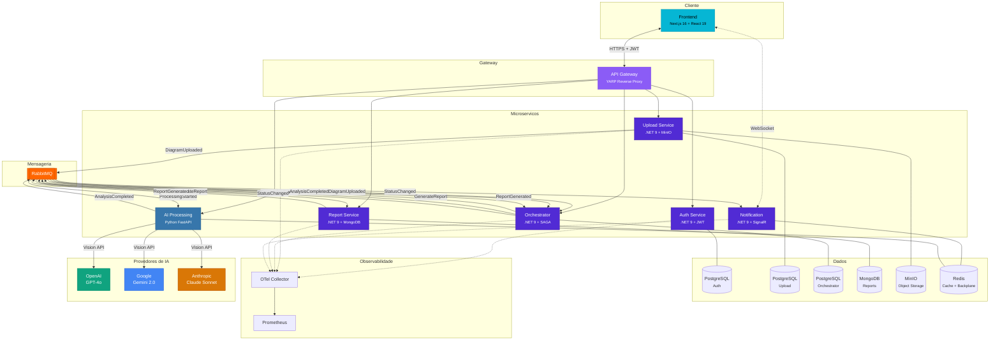
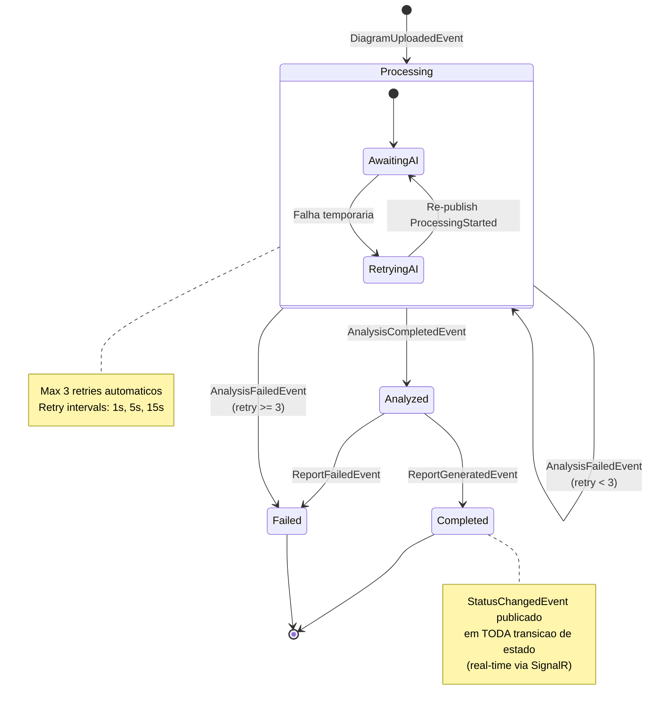
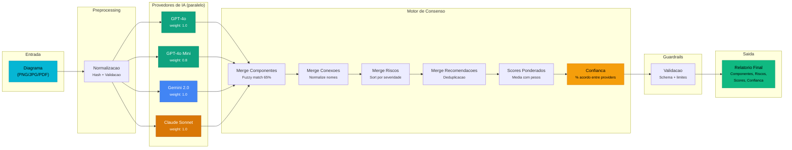
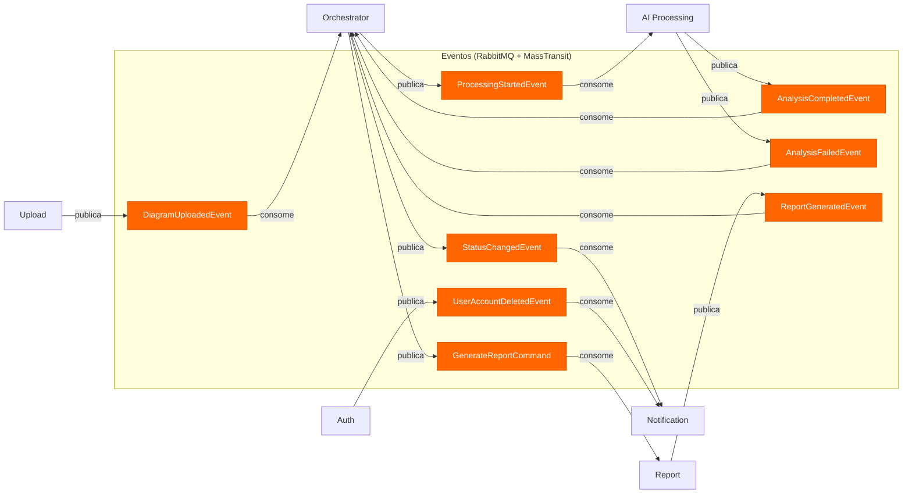
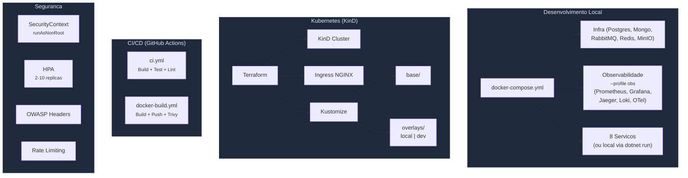

<div align="center">

# ArchLens

### Intelligent Architecture Diagram Analysis System

*Multi-provider AI consensus engine for automated software architecture review*

[](https://dotnet.microsoft.com)
[](https://python.org)
[](https://nextjs.org)
[](https://docker.com)
[](https://kubernetes.io)
[]()

</div>

---

## Sobre o Projeto

**ArchLens** e um sistema de analise inteligente de diagramas de arquitetura de software. O usuario faz upload de um diagrama (imagem ou PDF) e o sistema utiliza multiplos provedores de IA simultaneamente para identificar componentes, conexoes, riscos e recomendacoes, gerando um relatorio consolidado por meio de um **motor de consenso**.

### Por que ArchLens?

Em equipes de engenharia, revisoes de arquitetura dependem de especialistas seniores com disponibilidade limitada. O ArchLens democratiza esse processo ao combinar a visao de multiplos modelos de IA, eliminando o vies de um unico modelo e oferecendo uma analise mais robusta e confiavel.

### Diferenciais

- **Multi-provider AI com Consenso** - Nao depende de um unico modelo; combina respostas de GPT-4o, Gemini e Claude via fuzzy matching (Levenshtein)
- **SAGA Orquestrada** - Fluxo assincrono resiliente com retry automatico e rastreabilidade completa
- **Real-time** - Atualizacoes instantaneas via SignalR + Redis backplane
- **Observabilidade Integrada** - Admin dashboard com Prometheus, sem depender de ferramentas externas
- **LGPD by Design** - Consentimento explicito, exportacao/exclusao de dados, anonimizacao em logs

---

## Arquitetura

### Visao Geral do Sistema



### Fluxo Completo: Upload ate Relatorio

```mermaid
sequenceDiagram
    actor User
    participant FE as Frontend
    participant GW as Gateway
    participant UP as Upload Service
    participant MQ as RabbitMQ
    participant OR as Orchestrator
    participant AI as AI Processing
    participant RP as Report Service
    participant NT as Notification
    participant DB as Databases

    User->>FE: Upload diagrama (PNG/PDF)
    FE->>GW: POST /api/upload (JWT)
    GW->>UP: Proxy request

    rect rgb(30, 41, 59)
        Note over UP,DB: Upload & Persistencia
        UP->>DB: Salva metadados (PostgreSQL)
        UP->>DB: Upload arquivo (MinIO)
        UP->>MQ: DiagramUploadedEvent (Outbox)
    end

    rect rgb(30, 41, 59)
        Note over MQ,OR: Orquestracao SAGA
        MQ->>OR: DiagramUploadedEvent
        OR->>DB: Cria AnalysisSagaState
        OR->>MQ: ProcessingStartedEvent
        OR->>MQ: StatusChanged (Received → Processing)
    end

    MQ->>NT: StatusChanged
    NT-->>FE: SignalR push (Processing)
    FE-->>User: Status: Processando...

    rect rgb(30, 41, 59)
        Note over AI: Analise Multi-Provider (paralelo)
        MQ->>AI: ProcessingStartedEvent
        AI->>DB: Download diagrama (MinIO)

        par GPT-4o Vision
            AI->>AI: OpenAI analisa
        and Gemini 2.0 Flash
            AI->>AI: Google analisa
        and Claude Sonnet
            AI->>AI: Anthropic analisa
        end

        AI->>AI: Consensus Engine (merge + score)
        AI->>DB: Cache resultado (Redis)
        AI->>MQ: AnalysisCompletedEvent
    end

    rect rgb(30, 41, 59)
        Note over OR,RP: Geracao de Relatorio
        MQ->>OR: AnalysisCompletedEvent
        OR->>MQ: GenerateReportCommand
        OR->>MQ: StatusChanged (Processing → Analyzed)
        MQ->>RP: GenerateReportCommand
        RP->>DB: Salva relatorio (MongoDB)
        RP->>MQ: ReportGeneratedEvent
    end

    MQ->>NT: StatusChanged
    NT-->>FE: SignalR push (Analyzed)

    rect rgb(30, 41, 59)
        Note over OR: Finalizacao
        MQ->>OR: ReportGeneratedEvent
        OR->>MQ: StatusChanged (Analyzed → Completed)
    end

    MQ->>NT: StatusChanged
    NT-->>FE: SignalR push (Completed)
    FE-->>User: Relatorio completo disponivel!
```



### SAGA State Machine



### Pipeline de IA: Motor de Consenso



### Comunicacao entre Servicos



### Infraestrutura e Deploy



---

## Stack Tecnologico

| Camada | Tecnologia | Justificativa |
|--------|-----------|---------------|
| **Frontend** | Next.js 16, React 19, TypeScript, Tailwind CSS 4, shadcn/ui | SSR + performance + componentes acessiveis |
| **API Gateway** | .NET 9, YARP | Proxy reverso nativo .NET, JWT validation, rate limiting |
| **Servicos .NET** | .NET 9, Clean Architecture, MediatR, FluentValidation | CQRS + DDD + separation of concerns |
| **Servico IA** | Python 3.11+, FastAPI | Ecossistema ML/AI superior, async nativo |
| **Mensageria** | RabbitMQ + MassTransit | Outbox pattern, SAGA orchestration, retry policies |
| **Real-time** | SignalR + Redis backplane | WebSocket bidirecional, escalavel horizontalmente |
| **Bancos** | PostgreSQL, MongoDB, Redis | Relacional (auth/saga), Documento (reports), Cache |
| **Storage** | MinIO (S3-compatible) | Object storage para diagramas, API compativel AWS S3 |
| **Observabilidade** | OpenTelemetry, Prometheus, Grafana, Jaeger, Loki | Traces distribuidos, metricas, logs centralizados |
| **Deploy** | Docker, KinD, Kustomize, Terraform | Local + Cloud, infra como codigo |
| **CI/CD** | GitHub Actions | Build, test, Trivy scan, deploy automatizado |

---

## Servicos

| Servico | Porta | Banco | Responsabilidade |
|---------|-------|-------|-----------------|
| **API Gateway** | 5000 | - | Roteamento, autenticacao JWT, rate limiting |
| **Auth Service** | 5120 | PostgreSQL | Registro, login, JWT, LGPD (exportacao/exclusao) |
| **Upload Service** | 5066 | PostgreSQL + MinIO | Upload de diagramas, deduplicacao por hash SHA256 |
| **Orchestrator** | 5089 | PostgreSQL | SAGA state machine, coordenacao do fluxo |
| **AI Processing** | 8000 | Redis (cache) | Pipeline multi-provider, consenso, guardrails |
| **Report Service** | 5205 | MongoDB | Geracao e consulta de relatorios |
| **Notification** | 5150 | Redis (backplane) | Push real-time via SignalR |
| **Frontend** | 3000 | - | Interface web, admin dashboard |

---

## Como Executar

### Pre-requisitos

- Docker + Docker Compose
- .NET 9 SDK (para execucao local)
- Python 3.11+ (para AI Processing local)
- Node.js 18+ (para frontend local)

### Modo Docker (mais simples)

```bash
# Clonar e subir tudo
git clone <repo>
cd archlens

# Subir todos os servicos + infraestrutura
docker-compose up -d --build

# Ou usar o script de automacao
./archlens-docs/scripts/start.sh docker
```

### Modo Local (desenvolvimento)

```bash
# Subir apenas infraestrutura via Docker
./archlens-docs/scripts/start.sh

# Isso automaticamente:
# 1. Sobe infra (Postgres, RabbitMQ, MinIO, MongoDB, Redis)
# 2. Sobe observabilidade (Prometheus, Grafana, Jaeger, Loki)
# 3. Inicia os 6 servicos .NET via dotnet run
# 4. Inicia o AI Processing via uvicorn
# 5. Inicia o frontend via npm run dev
# 6. Executa health checks em todos os servicos
```

### Parar tudo

```bash
./archlens-docs/scripts/stop.sh
```

### Endpoints

| Servico | URL |
|---------|-----|
| Frontend | http://localhost:3000 |
| Gateway API | http://localhost:5000 |
| Swagger (Auth) | http://localhost:5120/swagger |
| Swagger (Upload) | http://localhost:5066/swagger |
| RabbitMQ Management | http://localhost:15672 |
| MinIO Console | http://localhost:9001 |
| Prometheus | http://localhost:9090 |
| Grafana | http://localhost:3001 |
| Jaeger | http://localhost:16686 |

### Credenciais de Teste

| Tipo | Usuario | Senha | Acesso |
|------|---------|-------|--------|
| Normal | `user` | `User@123` | Upload, analises, relatorios |
| Admin | `admin` | `Admin@123` | Tudo + Admin Dashboard |

---

## Seguranca

### Medidas Implementadas

| Categoria | Implementacao |
|-----------|--------------|
| **Autenticacao** | JWT HMAC-SHA256 com expiracao de 60min, BCrypt para senhas |
| **Autorizacao** | Role-based (User/Admin), policies no Gateway |
| **Headers de Seguranca** | X-Content-Type-Options, X-Frame-Options, X-XSS-Protection, Referrer-Policy, Permissions-Policy |
| **Rate Limiting** | FixedWindowRateLimiter em todos os servicos (auth-strict: 5 req/15s) |
| **Validacao de Entrada** | FluentValidation em todos os endpoints, magic bytes no upload |
| **HTTPS/TLS** | Comunicacao criptografada entre todos os servicos |
| **Containers** | runAsNonRoot, drop ALL capabilities, readOnlyRootFilesystem |
| **Scan de Vulnerabilidades** | Trivy em todas as imagens Docker |
| **Secrets** | Nenhum hardcoded, tudo via variaveis de ambiente |
| **Audit Log** | PersonalDataAccessAuditMiddleware para acesso a dados pessoais |
| **Upload Seguro** | Validacao de extensao + magic bytes + sanitizacao de nome + limite de tamanho |

### Conformidade OWASP Top 10

| # | Vulnerabilidade | Mitigacao |
|---|----------------|-----------|
| A01 | Broken Access Control | JWT + Role-based policies + Gateway authorization |
| A02 | Cryptographic Failures | BCrypt + HMAC-SHA256 + TLS |
| A03 | Injection | FluentValidation + parametrized queries (EF Core) |
| A04 | Insecure Design | Clean Architecture + DDD + input validation |
| A05 | Security Misconfiguration | Security headers middleware + rate limiting |
| A06 | Vulnerable Components | Trivy scan + dependabot |
| A07 | Auth Failures | Account lockout + strong password policy |
| A08 | Data Integrity | Outbox pattern + SAGA + idempotent consumers |
| A09 | Logging Failures | Serilog estruturado + OpenTelemetry + anonimizacao |
| A10 | SSRF | Whitelist de URLs para providers de IA |

### Seguranca da IA

- **Guardrails**: Validacao de schema na entrada e saida dos providers
- **Dados pessoais**: Nenhum dado do usuario e enviado aos providers (apenas o diagrama)
- **Transparencia**: Relatorio indica quais providers analisaram cada diagrama
- **Controle de alucinacoes**: Motor de consenso reduz alucinacoes via votacao cruzada
- **Fallback**: Sistema opera com 1 a N providers (degradacao graceful)

### Riscos e Limitacoes

| Risco | Descricao | Mitigacao |
|-------|-----------|-----------|
| Dependencia de providers externos | Indisponibilidade de APIs de IA | Retry automatico + fallback para providers disponiveis |
| Custo de API | Chamadas a OpenAI/Anthropic tem custo | Cache por hash de arquivo (evita re-analise) |
| Qualidade da analise | Depende da qualidade do diagrama | Guardrails + consenso + score de confianca |
| Secret management | Secrets em env vars (nao rotacionados) | Recomendacao: Sealed Secrets em producao |
| Criptografia em repouso | PostgreSQL sem encryption at rest | Recomendacao: habilitar em producao |

---

## LGPD - Conformidade

O ArchLens foi projetado com **Privacy by Design** seguindo a Lei Geral de Protecao de Dados (Lei 13.709/2018).

### Dados Coletados

| Dado | Finalidade | Base Legal | Retencao |
|------|-----------|-----------|----------|
| Username | Identificacao | Consentimento (Art. 7, I) | Ate exclusao da conta |
| Email | Comunicacao | Consentimento (Art. 7, I) | Ate exclusao da conta |
| Senha (hash BCrypt) | Autenticacao | Execucao de contrato (Art. 7, V) | Ate exclusao da conta |
| Diagramas | Analise de arquitetura | Consentimento explicito (Art. 7, I) | Configuravel (retention policy) |
| Relatorios | Resultado da analise | Execucao de contrato (Art. 7, V) | Ate exclusao da conta |

### Direitos do Titular (Art. 17-22)

| Direito | Endpoint | Descricao |
|---------|----------|-----------|
| Acesso/Portabilidade | `GET /auth/me/data` | Exporta todos os dados do usuario em JSON |
| Eliminacao | `DELETE /auth/me` | Exclui conta + cascata (uploads, reports, notificacoes) |
| Consentimento | Tela de registro | Checkbox explicito antes de criar conta |

### Medidas Tecnicas

- **Anonimizacao em logs**: Emails mascarados (`u***@archlens.com`)
- **Minimizacao**: Apenas dados estritamente necessarios sao coletados
- **Audit trail**: Middleware registra todo acesso a dados pessoais
- **Subprocessadores documentados**: OpenAI, Google Gemini, Anthropic Claude (nenhum dado pessoal enviado)
- **Politica de privacidade**: Disponivel em `/privacy-policy` no frontend

> Documentacao detalhada: [LGPD.md](./LGPD.md) | [SECURITY.md](./SECURITY.md)

---

## Observabilidade

### Stack

```
OpenTelemetry (.NET + Python)
    ├── Traces  → Jaeger (distribuido entre servicos)
    ├── Metricas → Prometheus → Grafana / Admin Dashboard
    └── Logs    → Loki → Grafana
```

### Admin Dashboard (Self-Contained)

O frontend inclui um **dashboard administrativo** (`/admin`) que consulta metricas diretamente do Prometheus via API route server-side (sem CORS), exibindo:

- **Service Health**: Status de todos os 7 servicos em tempo real
- **Metricas de Negocio**: Total de analises, taxa de sucesso, tempo medio, score medio
- **Infrastructure Metrics**: Request rate, error rate, latency P95 por servico
- **Analises por Estado**: Breakdown visual (Processing, Analyzed, Completed, Failed)
- **Provider Usage**: Quais providers de IA foram utilizados e com que frequencia

---

## Estrutura de Repositorios

```
archlens/
├── archlens-auth-service/           # Autenticacao + LGPD (.NET 9)
├── archlens-upload-service/         # Upload de diagramas (.NET 9)
├── archlens-orchestrator-service/   # SAGA orchestration (.NET 9)
├── archlens-report-service/         # Geracao de relatorios (.NET 9)
├── archlens-notification-service/   # Real-time SignalR (.NET 9)
├── archlens-ai-processing/          # Pipeline multi-provider (Python)
├── archlens-gateway/                # API Gateway YARP (.NET 9)
├── archlens-frontend/               # Interface web (Next.js 16)
├── archlens-contracts/              # Eventos compartilhados
├── archlens-docs/                   # Documentacao + scripts
├── archlens-infra-db/               # Configs Docker (Prometheus, OTel, Grafana)
├── archlens-infra-k8s/              # Kubernetes + Terraform
└── docker-compose.yml               # Orquestracao local
```

---

## Testes

| Servico | Tipo | Framework |
|---------|------|-----------|
| Upload | Unit + Architecture | xUnit + ArchUnitNET |
| Auth | Unit | xUnit + FluentAssertions |
| Report | Unit | xUnit + FluentAssertions |
| Orchestrator | Unit + SAGA | xUnit + MassTransit TestHarness |
| AI Processing | Unit | pytest (models, consensus, guardrails) |

```bash
# Executar todos os testes .NET
dotnet test archlens-auth-service/
dotnet test archlens-upload-service/
dotnet test archlens-report-service/
dotnet test archlens-orchestrator-service/

# Executar testes Python
cd archlens-ai-processing && pytest
```

---

## ADRs (Architecture Decision Records)

| ADR | Decisao | Motivacao |
|-----|---------|-----------|
| [001](./adr/ADR-001-polyrepo-clean-arch.md) | Polyrepo + Clean Architecture | Independencia de deploy, ownership claro por servico |
| [002](./adr/ADR-002-polyglot.md) | Polyglot (.NET 9 + Python) | Melhor ferramenta para cada dominio (enterprise + AI) |
| [003](./adr/ADR-003-multi-provider-ai.md) | Multi-provider AI + Consenso | Elimina vies de modelo unico, aumenta confiabilidade |
| [004](./adr/ADR-004-saga-orchestrated.md) | SAGA Orquestrada (MassTransit) | Rastreabilidade completa, retry automatico, estado persistido |
| [005](./adr/ADR-005-event-driven-outbox.md) | Event-driven + Outbox Pattern | Consistencia eventual garantida, zero mensagens perdidas |
| [006](./adr/ADR-006-observability.md) | OpenTelemetry + Prometheus + Grafana | Traces distribuidos, metricas unificadas, stack CNCF |
| [007](./adr/ADR-007-signalr-realtime.md) | SignalR + Redis backplane | Real-time bidirecional, escalavel horizontalmente |

---

## Limitacoes do Modelo de IA

| Limitacao | Descricao | Mitigacao |
|-----------|-----------|-----------|
| **Qualidade do diagrama** | Diagramas de baixa resolucao ou com texto ilegivel reduzem a precisao | Guardrails validam a resposta; score de confianca indica qualidade |
| **Vieses dos modelos** | Cada provider tem vieses diferentes na identificacao de riscos | Motor de consenso com votacao cruzada e Levenshtein fuzzy matching |
| **Alucinacoes** | Modelos podem inventar componentes ou conexoes inexistentes | Consenso exige acordo entre providers; componentes unicos sao filtrados |
| **Diagramas nao-convencionais** | Diagramas fora de padroes comuns (C4, UML) podem confundir | Prompt engineering com exemplos + fallback graceful |
| **Custo por analise** | Cada analise envolve 2-4 chamadas de API Vision | Cache por hash SHA256 evita re-analise de diagramas identicos |
| **Latencia** | Chamadas paralelas a 3+ providers levam 5-15 segundos | Real-time feedback via SignalR durante processamento |

---

<div align="center">

**ArchLens** - Analise inteligente de arquitetura, alimentada por consenso de IA.

*FIAP - Hackathon Fase 5 (12SOAT + 6IADT)*

</div>
